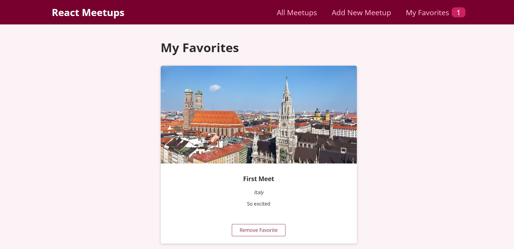
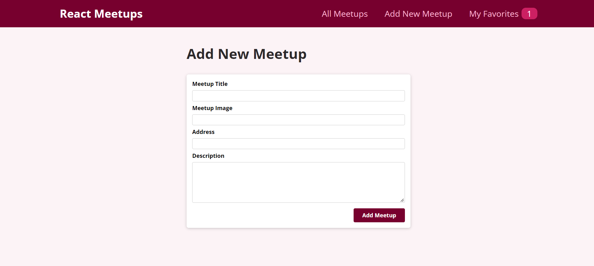

<div align="center">

[](https://github.com/ZeyadTarekk/React-Meetups/contributors)
[](https://github.com/ZeyadTarekk/React-Meetups/issues)
[](https://github.com/ZeyadTarekk/React-Meetups/blob/master/LICENSE)
[](https://github.com/ZeyadTarekk/React-Meetups/network)
[](https://github.com/ZeyadTarekk/React-Meetups/stargazers)
[](https://img.shields.io/github/languages/count/ZeyadTarekk/React-Meetups)

</div>

## 📝 Table of Contents

- [About](#about)
- [Get started](#get-started)
  - [Installation](#Install)
  - [Running](#running)
- [Technology](#tech)
- [Screenshots](#Screenshots)
- [Contributors](#Contributors)
- [License](#license)

## 📙 About <a name = "about"></a>
- A meetup page that allows you to add a meetup and store it in firebase.
- Fetches all the meetups from fireabase
- Favorite some meetings and add them to favorites page

## 🏁 Getting Started <a name = "get-started"></a>

> This is an list of needed instructions to set up your project locally, to get a local copy up and running follow these
> instructuins.

### Installation <a name = "Install"></a>

1. **_Clone the repository_**

```sh
$ git clone https://github.com/ZeyadTarekk/React-Meetups.git
```

2. **_Navigate to repository directory_**

```sh
$ cd React-Meetups
```

3. **_Install dependencies_**

```sh
npm install
```

### Running <a name = "running"></a>

1. **_Running on development mode_**

```sh
npm run dev
```

Open http://localhost:3000 with your browser to see the result

2. **_Compiling for production mode_**

```sh
npm run build
```

## 💻 Built Using <a name = "tech"></a>

- **React.js**
- **Firebase**

## 📷 Demo Screenshots <a name = "Screenshots"></a>

<div align="center">
<h3 align='left'>Main Screen</h3>
   
<h3 align='left'>Add to Favorites</h3>
   </a>

<h3 align='left'>Favorites Page</h3>
</a>
<h3 align='left'>Add a new meetup</h3>
</a>

</div>

## Contributors <a name = "Contributors"></a>

<table>
  <tr>
    <td align="center">
    <a href="https://github.com/ZeyadTarekk" target="_black">
    
    <br />
    <sub><b>Zeyad Tarek</b></sub></a>

  </tr>
 </table>

## License <a name = "license"></a>

> This software is licensed under MIT License, See [License](https://github.com/ZeyadTarekk/React-Meetups/blob/main/LICENSE) for more information.
